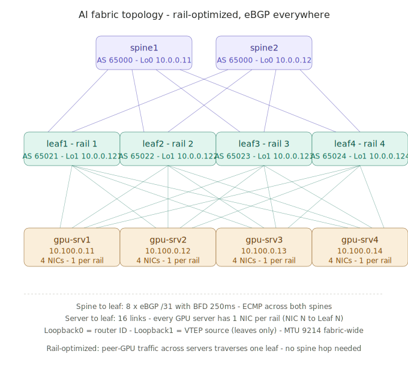

# ai-rocev2-lab

> 🚧 **WORK IN PROGRESS** Building in public. This lab is being constructed Task-by-Task configurations and documentation are evolving. Expect rapid changes for the next several weeks.

A reference AI/ML data center fabric implementation, automated end-to-end and documented as a build journal. Demonstrates the design patterns, configuration choices, and operational considerations for networks supporting GPU-dense training workloads using RoCEv2 over Ethernet.

## What this is

A working multi-switch leaf-spine fabric tuned for AI/ML traffic patterns: eBGP-everywhere underlay, EVPN VXLAN overlay, RoCEv2 lossless transport, dynamic load balancing for elephant flows, telemetry, and validation all
reproducible from a single repository.

Built with Arista cEOS in containerlab on a single workstation. The same design patterns translate directly to Cisco Nexus 9000 with documented syntax differences.

## What this is NOT

Honest scope, refined after lab experience:

**What's validated in this lab:**
1 eBGP-everywhere underlay with ECMP
2 EVPN VXLAN overlay (Type-2 MAC/IP and Type-3 IMET routes)
3 Anycast gateway with consistent virtual MAC
4 End-to-end Layer 2/3 connectivity across the fabric

**What's NOT validated in cEOS-lab and requires hardware:**
1 PFC pause frame generation (silicon-dependent, commands don't exist in cEOS)
2 ECN marking with WRED thresholds (queue management is silicon)
3 Dynamic Load Balancing (DLB) flowlet behavior
4 DCQCN response on host NICs

**What's planned in Phase 2:**
1 Cloud GPU validation: rent H100 instances, run nccl-tests, measure real RoCE/RDMA collective performance
2 Document threshold tuning impact under realistic AI traffic patterns

The fabric design is hardware-deployable to Arista 7280R3/7388X or Cisco Nexus 9300/9500 with documented syntax equivalence.

## Why I'm building this

I'm a network engineer with 13+ years of VXLAN EVPN experience (Cisco NDFC, ACI, spine-leaf at scale) studying what AI infrastructure demands of the network. Reading the Cisco AI/ML CVD, Meta's SIGCOMM 2024 RoCE paper, and
NVIDIA Spectrum-X documentation made it clear that 70% of an AI fabric is the same data center fabric I already know but the remaining 30% (RDMA semantics, lossless Ethernet, DCQCN tuning, elephant flow handling, rail optimized topology, JCT as the SLO) is genuinely different.

This repo is me bridging that 30% gap publicly.

## Topology

* 2 spines (eBGP, AS 65000)
* 4 leafs (rail optimized, AS 65021–65024 each)
* 4 simulated GPU servers (one per rail)
* All on a single workstation

## Build progress

* [x] Task 1 Host setup
* [x] Task 2 Virtual networking
* [x] Task 3 Pivot to containerlab + Arista cEOS
* [x] Task 4 Docker, containerlab, cEOS image
* [x] Task 5 Multi-switch topology deployed
* [x] Task 6 eBGP underlay
* [x] Task 7 EVPN VXLAN overlay
* [x] Task 8 RoCEv2 QoS (documentation; cEOS doesn't support hardware QoS)
* [x] Task 9 DLB and ECMP enhancements (documentation; silicon-dependent)
* [] Task 10 Ansible automation
* [] Task 11 pyATS validation
* [] Task 12 Telemetry
* [] Task 13 Documentation polish
* [] Task 14 Public release

## References

Design choices in this repo are informed by these sources. Configuration threshold values are cited where they come from published references rather than picked arbitrarily.

- [Cisco Data Center Networking Blueprint for AI/ML Applications](https://www.cisco.com/c/en/us/td/docs/dcn/whitepapers/cisco-data-center-networking-blueprint-for-ai-ml-applications.html)
- [Cisco Validated Design for AI/ML Networking](https://www.cisco.com/c/en/us/td/docs/dcn/whitepapers/cvd-for-data-center-networking-blueprint-for-ai.html)
- [Meta — RDMA over Ethernet for Distributed AI Training (SIGCOMM 2024)](https://engineering.fb.com/wp-content/uploads/2024/08/sigcomm24-final246.pdf)
- [NVIDIA Spectrum-X Architecture](https://www.nvidia.com/en-us/networking/spectrumx/)

## Connect

Following this build on LinkedIn — series of posts walking through each
phase:https://www.linkedin.com/in/raufarshad/

## License

MIT — see [LICENSE](LICENSE).
